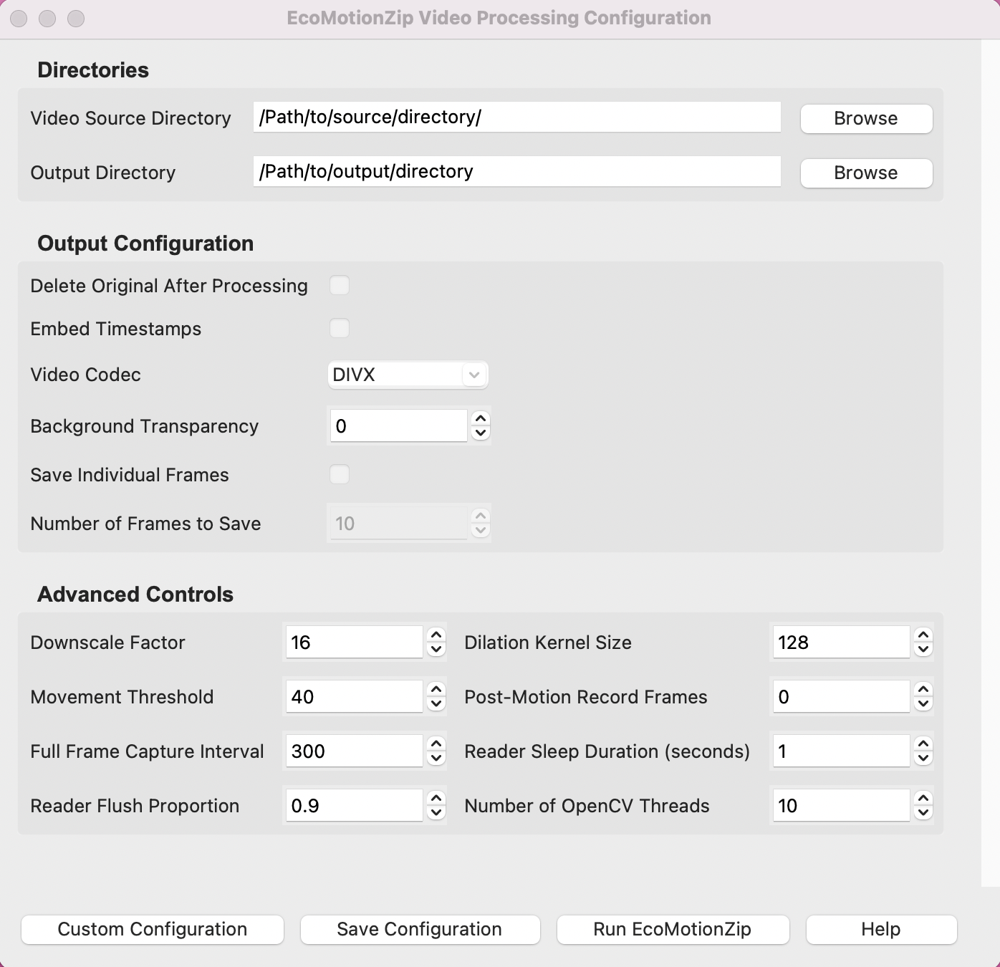

# EcoMotionZip
[](https://choosealicense.com/licenses/gpl-3.0/)


## Overview

EcoMotionZip is an open-source Python-based software developed for motion-based video compression and analysis. It is optimised for efficient and reliable video data compression on resource-constrained camera traps and desktop systems. By analysing motion data captured by video camera traps, EcoMotionZip selectively retains video segments with motion, enabling precise animal behaviour analysis through both automated and manual methods.

EcoMotionZip serves as a robust and flexible tool for researchers and practitioners working with video data, offering advanced capabilities to streamline workflows in video analysis and compression.

## Variants

EcoMotionZip is available in two versions:

1. **EcoMotionZip**: Designed for desktop systems, this version includes a user-friendly Graphical User Interface (GUI) for easy configuration and usage.
2. **EcoMotionZip Lite**: A command-line version tailored for resource-constrained devices, ensuring lightweight and efficient operation.

## Key Features

**1. Motion-Based Video Compression for Resource-Constrained Devices**

EcoMotionZip has been tested on devices such as Raspberry Pi microcomputers and NVIDIA Jetson platforms, demonstrating its ability to compress recorded videos effectively while minimising resource usage.

**2. Real-Time Video Compression and Capture**

EcoMotionZip facilitates real-time video capture and compression using Raspberry Pi systems integrated with the PiCamera2 library. This allows single-pass operation, enabling immediate video compression during capture.

**3. Compatibility with Polytrack for Automated Insect Tracking**

Videos compressed by EcoMotionZip can be directly processed by **Polytrack** to extract spatiotemporal details of insect movement, including the reconstruction of trajectories.

**4. Optimisation for Manual Behavioural Observations**

EcoMotionZip enhances camera trap videos for manual analysis by:
   - Removing inactive video segments.
   - Highlighting pixel regions with detected motion to draw the observer’s focus to relevant areas.

**5. Frame Extraction for AI Training**

EcoMotionZip enables the extraction of frames containing motion, saving them as images for creating datasets suitable for training Convolutional Neural Networks (CNNs) and other AI models.


## Installation

This guide provides detailed instructions on installing EcoMotionZip on macOS and Windows desktop systems. Instructions for installing EcoMotionZip on Raspberry Pi and other edge computing platforms will be provided separately.

Follow these steps to install EcoMotionZip on either macOS or Windows systems:

1. **Ensure Python is Installed**  
   EcoMotionZip requires Python 3.7 or later. Check if Python is installed by running the following command:
   ```bash
   python --version   
   ```
   If Python is not installed, download and install the latest version from the [official Python website](https://www.python.org/downloads/). On Windows, ensure you check the box to add Python to your PATH during installation.

2. **Install pip and virtualenv**  
   Install `pip` and `virtualenv` to manage dependencies:
   ```bash
   python -m ensurepip --upgrade  
   pip install --upgrade virtualenv
   ```

3. **Clone the EcoMotionZip Repository**  
   Clone the repository from GitHub:
   ```bash
   git clone https://github.com/your-repository/EcoMotionZip.git
   cd EcoMotionZip
   ```

4. **Set Up a Virtual Environment**  
   Create and activate a virtual environment:
   ```bash
   python -m virtualenv venv   
   ```
   
   Activate the virtual environment
   ```bash
   source venv/bin/activate    # macOS
   venv\Scripts\activate      # Windows
   ```

5. **Install Dependencies**  
   Install the required packages from the `requirements.txt` file:
   ```bash
   pip install -r requirements.txt
   ```


## Usage

Once EcoMotionZip is installed, follow these steps to activate the virtual environment and run the software:

1. Open the terminal (macOS) or Command Prompt/PowerShell (Windows) and navigate to the directory where EcoMotionZip is installed:
   ```bash
   cd /path/to/EcoMotionZip  # macOS
   cd \path\to\EcoMotionZip  # Windows
   ```

2. Activate the virtual environment:
   ```bash
   source venv/bin/activate  # macOS
   venv\Scripts\activate    # Windows
   ```

3. Run the software located in the `./src/` directory:
   ```bash
   python ./src/EcoMotionZip.py
   ```

## User Interface

{width=70 height=65 }
*Figure 1: The graphical user interface of EcoMotionZip, showcasing the main features and controls for video compression and analysis.*

Figure 1 shows the user interface of the EcoMotionZip software. The user interface is designed for ease of use, with buttons that allow users to perform essential operations:

- **Custom Configuration:** Load a `.json` file with a custom configuration.

- **Save Configuration:** Save the current configuration settings for future use.

- **Run EcoMotionZip:** Start the video compression and analysis process based on the current configuration. The video processing status will be displayed in a window.

- **Help:** Access the user manual and documentation, which includes detailed parameter descriptions and usage tips.


## Cite As

If you use EcoMotionZip in your research, please cite it as follows:

```
@article{ratnayake2024motion,
title={Motion-based video compression for resource-constrained camera traps},
author={Ratnayake, Malika Nisal and Gallon, Lex and Toosi, Adel N and Dorin, Alan},
journal={arXiv preprint arXiv:2405.14419},
year={2024}
}
```


## License

EcoMotionZip is licensed under the [GPL-3.0 License](LICENSE).

## Contact

If you have any questions, feel free to reach out to us at [email](mailto:malika.ratnayake@monash.edu).

## References

* [Bees-edge](https://github.com/byebrid/bees-edge) by [Lex Gallon](https://github.com/byebrid).
* [Basic motion detection and tracking with Python and OpenCV](https://pyimagesearch.com/2015/05/25/basic-motion-detection-and-tracking-with-python-and-opencv/) by [pyimagesearch](https://pyimagesearch.com)
* [Increasing webcam FPS with Python and OpenCV](https://pyimagesearch.com/2015/12/21/increasing-webcam-fps-with-python-and-opencv/) by [pyimagesearch](https://pyimagesearch.com)


