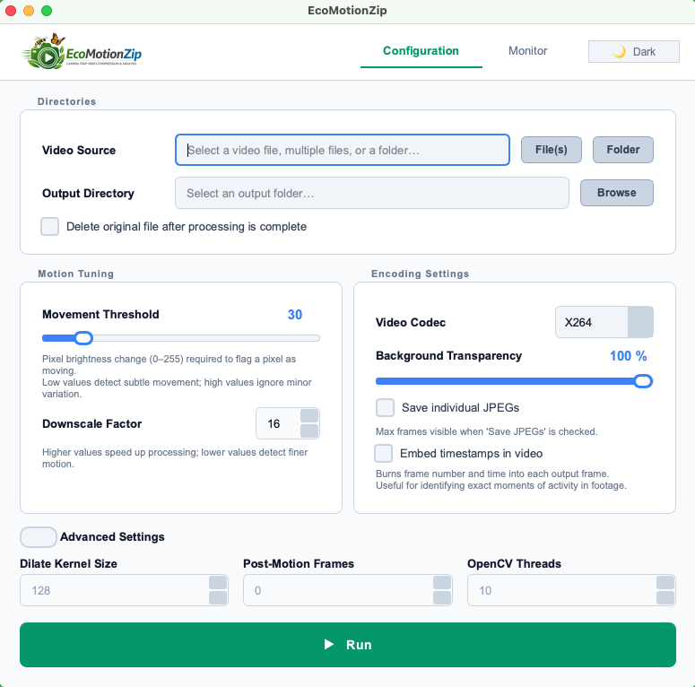
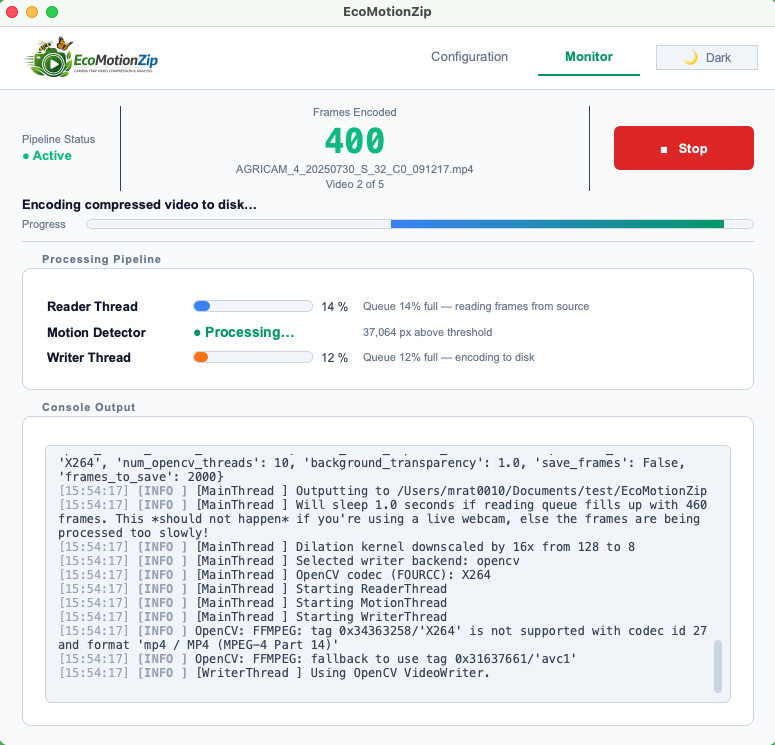

<p align="center">
    
</p>

# EcoMotionZip
[](https://choosealicense.com/licenses/gpl-3.0/)

EcoMotionZip is an open-source tool for **motion-based video compression** designed for wildlife camera traps and ecological monitoring. It analyses video footage and keeps only the parts where something is moving — dramatically reducing file sizes while preserving the moments that matter for research and analysis.

This approach is especially valuable for tracking small organisms such as insects, which can be difficult to detect within a large field of view and are often missed during manual video observation. By focusing only on motion events, EcoMotionZip also significantly reduces the time required for reviewing footage.

---

## Which version should I use?

| I want to… | Use this |
|---|---|
| Process videos on my **Mac or Windows laptop/desktop** using a graphical interface | **Desktop App** — see [Desktop Installation](docs/install-desktop.md) |
| Run it on a **Raspberry Pi** or process videos automatically without a screen | **Headless Mode** — see [Raspberry Pi Installation](docs/install-raspberry-pi.md)  |
| Compress video **live while recording** with a Pi camera | **Headless Mode** on Raspberry Pi (Beta)  |

Both modes use exactly the same compression engine. The Desktop App simply provides a graphical interface to configure and monitor that same engine.

---

## Desktop App (Mac / Windows)

<p align="center">
    
    
</p>

The desktop application provides a graphical interface for:

- Selecting video files or folders to process
- Adjusting motion sensitivity and compression settings
- Monitoring processing progress in real time
- Viewing compression results and statistics

**→ [Desktop Installation Guide](docs/install-desktop.md)**

Quick start (after installation):

```bash
python run_desktop.py
```

---

## Headless Mode (Raspberry Pi / Command Line)

Run EcoMotionZip without a screen — ideal for Raspberry Pi camera traps, remote servers, or automated pipelines.

**→ [Raspberry Pi Installation Guide](docs/install-raspberry-pi.md)**

Quick start (after installation):

```bash
python run_headless.py --video_source /path/to/video.mp4 --output_directory /path/to/output
```

All options:

```bash
python run_headless.py --help
```

---

## Key Features

- **Motion-selective compression** — retains only frames containing movement; discards inactive segments
- **Real-time capture and compression** — single-pass operation with Raspberry Pi camera (PiCamera2)
- **Multiple output codecs** — X264, DIVX, FFV1, HEVC via FFmpeg
- **Frame-level sidecar CSV** — maps every output frame back to the original source timestamp
- **Optional JPEG snapshots** — extracts motion frames as images for AI/ML dataset creation
- **Polytrack compatible** — output videos work directly with Polytrack for insect trajectory analysis
- **Configurable detection** — tune sensitivity, downscale factor, dilation kernel, and post-motion buffering
- **Background blending** — optionally preserve spatial context in non-motion regions

---

## Configuration

All settings are stored in `config.json` in the project folder. The Desktop App lets you change these through its interface. For headless use, edit `config.json` directly or override individual values on the command line.

Key settings:

| Setting | Description | Default |
|---|---|---|
| `movement_threshold` | Pixel brightness change (0–255) needed to flag motion | 40 |
| `downscale_factor` | How much to shrink frames before analysis (higher = faster) | 16 |
| `video_codec` | Output codec: `X264`, `DIVX`, `FFV1`, `HEVC` | `X264` |
| `background_transparency` | Opacity of non-motion regions (0.0 = black, 1.0 = full) | 0.0 |
| `save_frames` | Also save motion frames as individual JPEG images | false |
| `embed_timestamps` | Burn frame number/time into each output frame | false |
| `delete_original_after_processing` | Remove source file after successful compression | false |

---

## Project Structure

```
EcoMotionZip/
├── run_desktop.py          ← Launch the desktop GUI
├── run_headless.py         ← Run from command line / Raspberry Pi
├── config.json             ← Default settings
├── requirements.txt        ← Core dependencies (headless)
├── requirements-gui.txt    ← Desktop GUI dependencies
├── ecomotioinzip/
│   ├── pipeline.py         ← Core compression engine
│   └── app.py              ← Desktop GUI application
└── docs/
    ├── install-desktop.md
    └── install-raspberry-pi.md
```

---

## Cite As

If you use EcoMotionZip in your research, please cite:

```bibtex
@article{ratnayake2024motion,
  title   = {Motion-based video compression for resource-constrained camera traps},
  author  = {Ratnayake, Malika Nisal and Gallon, Lex and Toosi, Adel N and Dorin, Alan},
  journal = {arXiv preprint arXiv:2405.14419},
  year    = {2024}
}
```

---

## License

EcoMotionZip is licensed under the [GPL-3.0 License](LICENSE).

## Contact

Questions or feedback: [malika.ratnayake@monash.edu](mailto:malika.ratnayake@monash.edu)
or open an [issue on GitHub](https://github.com/malikaratnayake/EcoMotionZip/issues).

## References

- [Bees-edge](https://github.com/byebrid/bees-edge) by [Lex Gallon](https://github.com/byebrid)
- [Basic motion detection and tracking with Python and OpenCV](https://pyimagesearch.com/2015/05/25/basic-motion-detection-and-tracking-with-python-and-opencv/) — pyimagesearch
- [Increasing webcam FPS with Python and OpenCV](https://pyimagesearch.com/2015/12/21/increasing-webcam-fps-with-python-and-opencv/) — pyimagesearch
